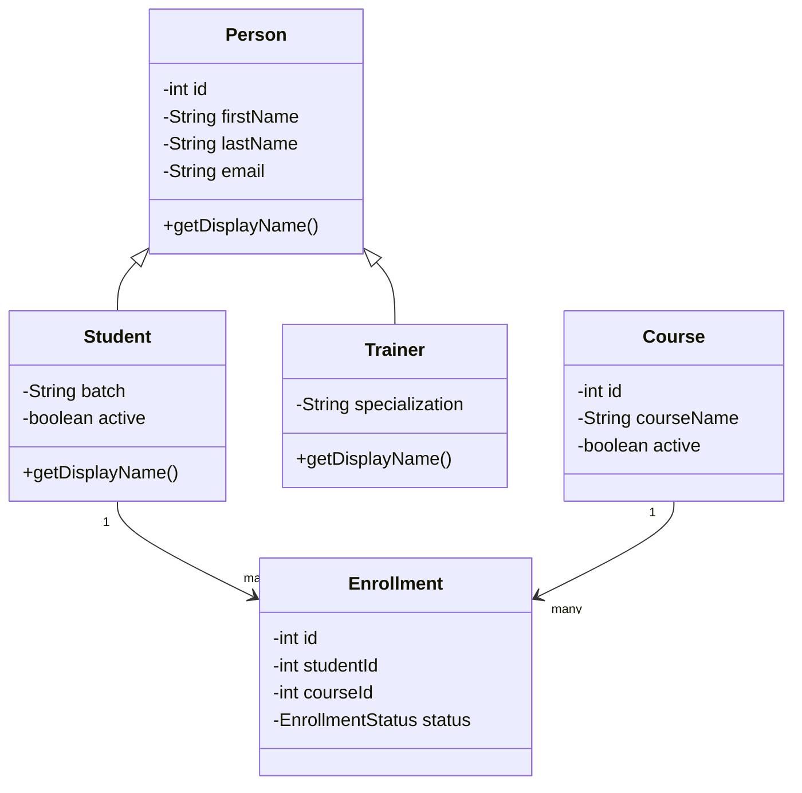

# LearnTrack

A console-based Student & Course Management System built in Core Java.
This project covers OOP fundamentals, collections, exception handling, and clean code structure.

---

## Project Structure

```
learntrack/
├── src/
│   └── com/airtribe/learntrack/
│       ├── entity/          Person, Student, Trainer, Course, Enrollment, EnrollmentStatus
│       ├── service/         StudentService, CourseService, EnrollmentService
│       ├── exception/       EntityNotFoundException, InvalidInputException
│       ├── util/            IdGenerator, InputValidator
│       └── ui/              Main.java  ← entry point
├── docs/
│   ├── Setup_Instructions.md
│   ├── JVM_Basics.md
│   └── Design_Notes.md
└── README.md
```

---

## How to Compile

Make sure you have JDK is installed.

```bash
# From the project root
javac -d out $(find src -name "*.java")
```

---

## How to Run

```bash
java -cp out com.airtribe.learntrack.ui.Main
```

---

## Features

**Student Management**
- Add student (with or without email — constructor overloading)
- View all students
- Search by ID or name
- Update email / batch
- Deactivate / reactivate (soft delete — history is preserved)

**Course Management**
- Add course
- View all / search by name
- Activate / deactivate
- Update duration

**Enrollment Management**
- Enroll a student in a course (with duplicate and inactive checks)
- View enrollments by student or course
- Mark enrollment as COMPLETED or CANCELLED

**Dashboard** — live count of students, courses, and enrollments.

---

## Sample Data

On startup, the app pre-loads 4 students, 3 courses, and 4 enrollments so you can test all features immediately.
## Class Diagram



